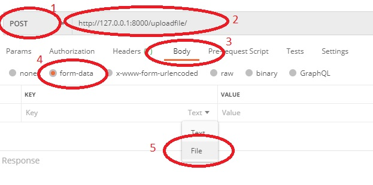

# Face Match score
It takes two input images for face detection and scoring.

There are two modules involved
1. Face Detection
1. Face match score

---
## Face Detection
It applies deep learning approach to detect faces in the input images.

___
## Face match score
It calulates the match score between two detected faces. It also takes deep learning approach for match calculation
___
## Installation and use 
It is advisable to create virtual environment before going ahead.
After creating a virtual environment go to the Face_score folder.
```bash
cd Face_score
```
Install all the requirements
```bash
pip install -r requirements.txt
```
After installing all the requirements, run the below command in command line
```bash
uvicorn app:app --reload
```
you will get something like this
```bash
INFO:     Uvicorn running on http://127.0.0.1:8000 (Press CTRL+C to quit)
INFO:     Started reloader process [12820] using statreload
```
Copy and paste the above url http://127.0.0.1:8000 in browser.

Upon changing the url to http://127.0.0.1:8000/docs , application can be used to pass two images to calculate face match score

click on ___POST___ and then on ___Try it out___


Upload two images using ___Add item___ button and click on ___Execute___

Face match score will be calculated and result will be given as shown below.

___
# Testing using Postman
To test API on postman, install postman on your system. Open postman on your system. Click on "+" as shown below.


Follow the steps:
1. change the request to ___POST___
1. Copy paste the url in the given place
1. Select ___Body___
1. select __form_data__
1. select __File__



After doing the above steps follow the step to upload file and calculate face match score
1. give key values as *images*
1. upload two images at a time 
1. click on ___send___ button
1. get the calculted face match score

